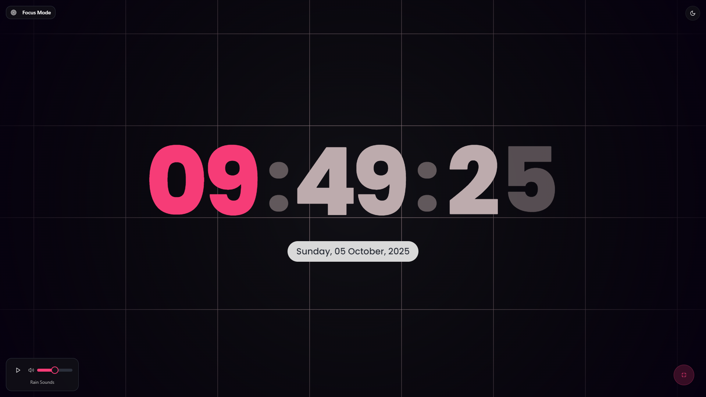

  
  <h1 align="center">Uwu Clock</h1>
  
A simple clock with a focus mode and rain sounds.

## Features

- ⌚ Focus mode: Reduce distractions and improve focus.
- 🌧️ Rain sounds: Enjoy the soothing sound of rain in the background.
- 🌏 Responsive design: Works seamlessly on desktops, tablets, and mobile devices.

## Technologies Used

- React : [https://react.dev/](https://react.dev/)
- TypeScript : [https://www.typescriptlang.org/](https://www.typescriptlang.org/)
- Framer Motion : [https://motion.dev/](https://motion.dev/)
- React Bits : [https://reactbits.dev/](https://reactbits.dev/)

## Credits

- [RelaxingClock](https://www.relaxingclock.com/) - Inspiration for the project idea.
- [ReactBits](https://reactbits.dev/) - Background animation snippet.
- [RainyMood](https://rainymood.com/) - Inspiration for the rain sounds.
